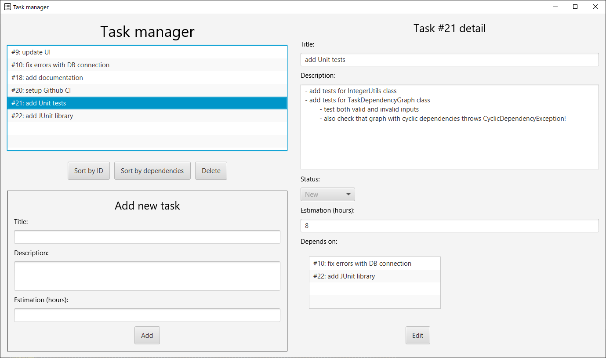
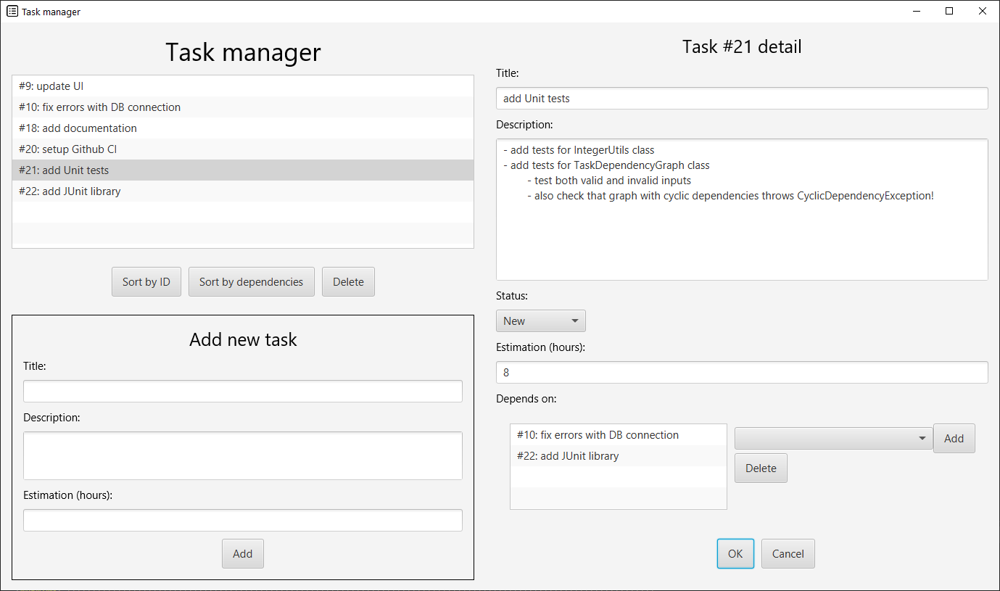

# Task Manager
## Introduction
This repository contains a desktop app for task management, which can be used for any type of tasks/activies that you're doing/plan to do.
More specifically, the program allows you to
- list all the tasks
- add new tasks
- delete tasks
- update task properties
- manage dependencies between tasks (e.g. you can set that Task #1 depends on Task #2 i.e. completing Task #2 is prerequisite for completing Task #1)

Each task contains the following properties:
- ID - unique identifier of the task
- title
- description
- estimation (estimated time in hours for completing the task)
- status (New, In Progress or Completed)
- its dependencies (other tasks)

The app is developed using JavaFX and the data are stored in SQLite database (program automatically creates file **database.db** in the root directory).

## Usage
### Requirements
- JDK 15
- Maven

### Run
The app is multi-platform, you just need to run
```shell
> mvn javafx:run
```
in the root directory.

There are example data in [example_data.sql](example_data.sql) file. You can insert these data into the database (file database.db) 
using [SQLite Command line shell](https://sqlite.org/cli.html) or [GUI](https://sqlitebrowser.org/) - just copy-paste the SQL script.
Then click on "Sort by Id", which reloads data from the database or restart the app.\
**Make sure that you haven't created any tasks before that** (example data contain hard-coded task IDs). If you had, **delete the database (file database.db), restart the 
app and run the SQL again.**\
If the database file doesn't exist, run the app, it will create it automatically.

## UI & Functionality





